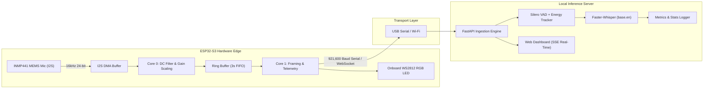
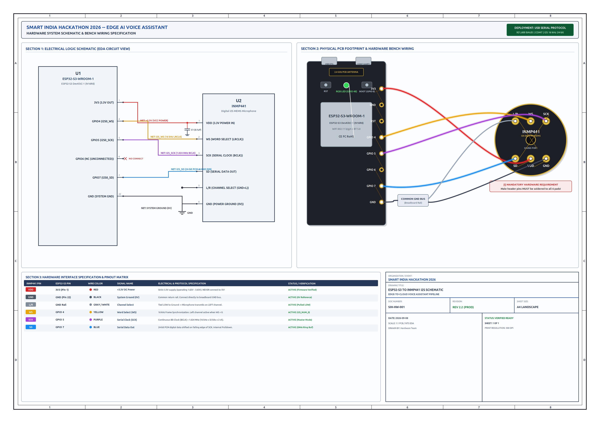

# 🎙️ Smart India Hackathon (SIH) Edge AI Voice Assistant

[](https://opensource.org/licenses/MIT)
[](https://www.espressif.com/en/products/socs/esp32-s3)
[](https://invensense.tdk.com/products/inmp441/)
[](https://github.com/SYSTRAN/faster-whisper)
[](https://github.com/snakers4/silero-vad)
[](https://fastapi.tiangolo.com/)

A high-performance, low-latency **Edge-to-Server Voice Assistant** engineered for the **Smart India Hackathon (SIH)**. The system combines dedicated edge hardware (ESP32-S3 with an INMP441 omnidirectional MEMS microphone) with a high-speed Python inference server featuring Faster-Whisper, Silero Voice Activity Detection (VAD), and an interactive real-time telemetry dashboard.

---

## 📑 Table of Contents
1. [Key Features](#-key-features)
2. [System Architecture](#-system-architecture)
3. [Hardware & Wiring](#-hardware--wiring)
4. [Repository Structure](#-repository-structure)
5. [Firmware Configuration & Flashing](#-firmware-configuration--flashing)
6. [Server Setup & Quickstart](#-server-setup--quickstart)
7. [Web Dashboard & Metrics](#-web-dashboard--metrics)
8. [License & Acknowledgments](#-license--acknowledgments)

---

## ⚡ Key Features

* **Dual-Mode Edge Streaming**:
  * **High-Speed USB Serial Mode**: Streams binary 16 kHz 16-bit PCM frames at **921,600 baud** for instantaneous, zero-latency desktop prototyping.
  * **Wi-Fi WebSocket Mode**: Seamless transition to wireless local network streaming for deployed edge appliances.
* **Dual-Core FreeRTOS Partitioning**:
  * **Core 0**: Dedicated to uninterrupted I2S DMA audio capture, pre-scale 40 Hz DC high-pass filtering, and dynamic energy analysis.
  * **Core 1**: Manages the true FIFO ring buffer, high-speed packet framing, real-time telemetry JSON reporting, and bi-directional command processing.
* **Visual Diagnostic Feedback**:
  * Onboard **WS2812 RGB LED (GPIO 48)**:
    * 🔴 **Constant Red**: System idle / listening for acoustic speech.
    * 🟢 **Solid Green**: Mic actively detecting speech / voice energy.
    * 🔴 **4x Red Flash**: Wake trigger event initiated.
* **Intelligent Server Pipeline**:
  * **Safe Peak Normalization**: Eliminates harmonic clipping distortion while preserving natural vocal dynamics.
  * **Faster-Whisper (base.en / int8)**: Local, sub-second transcription with anti-repetition guards and loop suppression.
  * **Acoustic Energy & Silero VAD**: Automatically finalizes recordings within 1.0s of post-speech silence, slashing total end-to-end latency from ~4.5s down to ~1.5s.
* **Live Telemetry & Diagnostics Dashboard**:
  * Real-time Server-Sent Events (SSE) web interface tracking ESP32 free heap, CPU load, microphone peak levels, transcription results, and end-to-end latency.

---

## 🏗️ System Architecture



---

## 🔌 Hardware & Wiring

### Pin Connection Table

| INMP441 MEMS Pin | ESP32-S3 DevKit Pin | Function / Wire Color | Notes |
| :--- | :--- | :--- | :--- |
| **VDD** | **3V3** | 3.3V Power (Red) | Clean 3.3V power rail |
| **GND** | **GND** | Ground (Black) | Common ground |
| **L/R** | **GND** | Channel Select (Black) | Tied to GND for Left Channel |
| **WS** | **GPIO 4** | Word Select (White) | I2S Word Select clock |
| **SCK** | **GPIO 5** | Serial Clock (Purple) | Continuous bit clock |
| **SD** | **GPIO 7** | Serial Data (Blue) | PCM serial audio data output |
| *Onboard* | **GPIO 48** | Built-in WS2812 RGB LED | Status indicator |
| *BOOT Button* | **GPIO 0** | Manual Trigger Switch | Hardware fallback trigger |

> [!IMPORTANT]
> Ensure the **L/R** pin is firmly connected to **GND**. When tied to ground, the INMP441 outputs audio on the left channel slot.

### Publication-Grade Circuit Diagram
An engineering-grade A4 printable schematic is provided in [`docs/circuit_diagram_A4.pdf`](docs/circuit_diagram_A4.pdf).



---

## 📂 Repository Structure

```
SIH-ESP32-S3-Voice-Assistant/
├── docs/
│   ├── circuit_diagram_A4.pdf       # Publication-grade printable A4 schematic
│   ├── circuit_diagram_A4.png       # High-resolution PNG preview of schematic
│   └── circuit_diagram.png          # System wiring reference
├── firmware/
│   ├── esp32_sih_hard_ware_firmware.ino # Dual-mode ESP32-S3 production firmware
│   └── kws_model_data.h             # Embedded Keyword Spotting (KWS) TFLite model
├── server/
│   ├── server.py                    # FastAPI server, Faster-Whisper, VAD & Dashboard
│   ├── requirements.txt             # Python dependencies
│   └── kws_extracted.tflite         # Standalone KWS neural network model
├── .gitignore
├── LICENSE                          # MIT License
└── README.md
```

---

## 🚀 Firmware Configuration & Flashing

1. **Open in Arduino IDE**:
   * Open `firmware/esp32_sih_hard_ware_firmware.ino`.
2. **Select Board & Settings**:
   * **Board**: `ESP32S3 Dev Module`
   * **USB CDC On Boot**: `Enabled`
   * **Flash Size**: `8MB (64Mb)` or `4MB`
   * **Partition Scheme**: `Default 4MB with spiffs`
   * **Port**: Select your ESP32-S3 COM port (e.g. `COM7`).
3. **Configure Operating Mode**:
   * For USB Serial prototyping (default):
     ```cpp
     #define ENABLE_NETWORK_STREAM 0   // 0 = USB Serial, 1 = Wi-Fi WebSocket
     ```
   * For Wi-Fi WebSocket streaming:
     ```cpp
     #define ENABLE_NETWORK_STREAM 1
     #define WIFI_SSID   "Your-WiFi-SSID"
     #define WIFI_PASS   "Your-WiFi-Password"
     #define WS_HOST     "192.168.1.100"  // IP address of your server PC
     #define WS_PORT     8080
     ```
4. **Compile & Upload**:
   * Click **Upload (→)**.

---

## 💻 Server Setup & Quickstart

### 1. Requirements
* Python 3.10, 3.11, or 3.12 (Windows / Linux)
* Modern browser (Chrome, Edge, Firefox)

### 2. Install Dependencies
```bash
cd server
pip install -r requirements.txt
```

### 3. Start the Server
```bash
python server.py
```
*The server will initialize Faster-Whisper, load the Silero VAD model, and open COM7 at 921,600 baud.*

---

## 📊 Web Dashboard & Metrics

Access the live diagnostic dashboard at:
**[http://localhost:8080/dashboard](http://localhost:8080/dashboard)**

The dashboard displays:
* **Live Connection Status**: Serial / WebSocket state, active baud rate, packet heartbeat.
* **Microphone Diagnostic Meter**: Visual audio level monitor with silence/speech boundary detection.
* **Transcription Feed**: Live real-time transcription history with Keyword Spotting (KWS) verification badges.
* **Performance Metrics**: Audio duration, Whisper processing latency, end-to-end latency, ESP32 CPU load, and internal SRAM usage.

---

## 📜 License & Acknowledgments

This project is licensed under the **MIT License** - see the [LICENSE](LICENSE) file for details.

Developed for **Smart India Hackathon (SIH)** by **Arpit Kumar** ([@arpitkumar81008-cmd](https://github.com/arpitkumar81008-cmd)).
